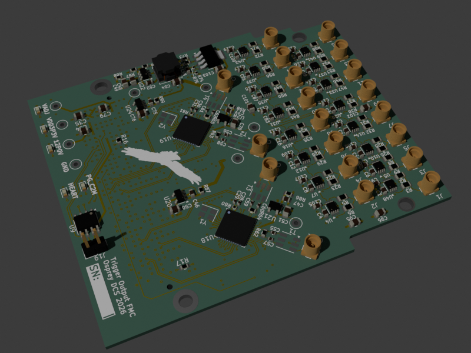

# Trigger Output FMC

A single width HPC FMC board which provides 16 low jitter TTL outputs,
along with two Si5394 jitter cleaners with outputs connected to the MGTREF capable
when matched with the [LBL Marble](https://github.com/BerkeleyLab/Marble) FMC carrier.

This design is Open Hardware created by Osprey DCS and published under the terms of the
[CERN Open Hardware Licence Version 2 - Strongly Reciprocal](cern_ohl_s_v2.txt) license.

This repository contains KiCad 9.0.4 design files.

- [Data sheet](datasheet.md)
- [Current generated](https://osprey-dcs.github.io/trigger-output-fmc/)
  - [Schematic](https://osprey-dcs.github.io/trigger-output-fmc/trigger-output-fmc-schematic.pdf)
  - [BoM](https://osprey-dcs.github.io/trigger-output-fmc/trigger-output-fmc-bom.csv)
  - [STeP model](https://osprey-dcs.github.io/trigger-output-fmc/3D/trigger-output-fmc-3D.step)

## Block Diagram

## Status

Incomplete, under development, and not yet produced.

